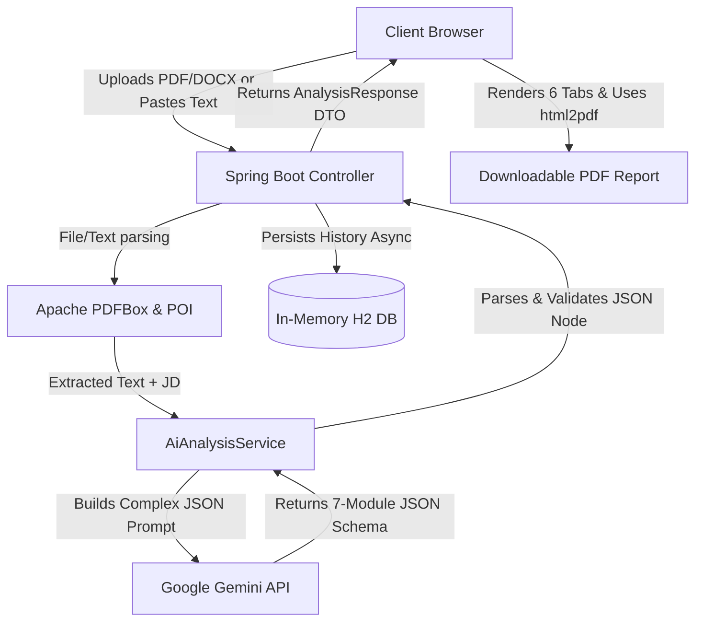

#  SmartHire AI — AI-Powered Resume Analyzer

SmartHire AI is a resume analysis tool built using Spring Boot and Google Gemini 2.5 Flash models.
The application compares a resume with a job description and provides an ATS-style evaluation with suggestions for improvement.

Users can upload resumes in PDF or DOCX format and receive:

 - ATS score

 - Matching skills

# 🚀 SmartHire AI — Career Success Platform

<div align="center">
  
  
  
</div>

---

*"SmartHire AI helps candidates analyze resumes, optimize ATS performance, prepare for interviews, identify skill gaps, improve career readiness, and maximize job success."*

SmartHire AI is an advanced, production-ready SaaS platform that goes far beyond simple resume parsing. It leverages the intelligence of **Google Gemini** to offer a complete **Career Success Suite**, seamlessly integrating document extraction, natural language processing, and personalized career guidance into one beautifully designed interface.

## ✨ New Career Success Suite Features

- 🎯 **Advanced ATS Scoring:** Instantly calculates keyword and experience match scores against a specific Job Description.
- 🚦 **Keyword Gap Analysis:** Automatically identifies missing technical and soft skills, categorizing them by High, Medium, or Low impact on your ATS ranking.
- 💡 **Resume Enhancement Assistant:** Provides section-wise, natural language rewrites to incorporate missing skills without keyword stuffing.
- 🧠 **AI Interview Preparation Center:** Dynamically generates top personalized interview questions, categorized by difficulty, along with answering guidance.
- 📊 **Profile Improvement Insights:** Highlights your strongest matching areas and identifies missing experience indicators.
- 🚀 **Personalized Learning Roadmap:** Maps out a custom learning path, including priority skills to learn, technologies to explore, and recommended certifications.
- 📈 **ATS Improvement Simulator:** Predicts your new ATS score after applying the AI's suggested resume enhancements.
- 📄 **Career Success Report:** Export all insights, roadmaps, and interview questions into a clean, downloadable PDF report.

## 🏗️ Architecture & Data Flow



## 🛠️ Technology Stack

- **Frontend:** Vanilla HTML5, CSS3 (Custom Design System), JavaScript (ES6), html2pdf.js
- **Backend:** Java 17, Spring Boot 3.3.4, Spring Web, Spring Data JPA
- **AI Engine:** Google Gemini 1.5 Flash (via REST API)
- **Document Processing:** Apache PDFBox (PDFs), Apache POI (Word Docs)
- **Database:** H2 In-Memory Database (for history tracking)
- **Deployment:** Render Web Services (CI/CD linked to GitHub)

## 🚀 Setup & Local Deployment

### Prerequisites
- JDK 17+ installed
- Maven installed
- A Google Gemini API Key

### Installation

1. **Clone the repository:**
   ```bash
   git clone https://github.com/shayan-304/smarthire-ai.git
   cd smarthire-ai
   ```

2. **Set your API Key:**
   You must set the `GEMINI_API_KEY` environment variable.
   *Windows (PowerShell):*
   ```powershell
   $env:GEMINI_API_KEY="your_api_key_here"
   ```
   *Mac/Linux:*
   ```powershell
   export GEMINI_API_KEY="your_api_key_here"
   ```

3. **Run the application:**
   ```bash
   mvn spring-boot:run
   ```

4. **Access the application:**
   Open your browser and navigate to `http://localhost:8080`.              → main app
# http://localhost:8080/api/health   → health check
# http://localhost:8080/h2-console   → view saved analysis data
```

---

## Deploy Free on Render.com

1. Push to GitHub
2. Go to [render.com](https://render.com) → New → Web Service
3. Connect repo `shayan-304/smarthire-ai`
4. Select **Docker** | Plan: **Free**
5. Add env var: `GEMINI_API_KEY` = your key
6. Click Deploy → live HTTPS URL in ~5 minutes

---

## API Endpoints

| Method | Endpoint | Purpose |
|--------|----------|---------|
| POST | `/api/analyze` | Analyze via pasted text |
| POST | `/api/upload-analyze` | Analyze via PDF/DOCX file |
| GET | `/api/health` | Health check (Render uses this) |
| GET | `/api/history` | Last 20 saved analyses |
| GET | `/api/stats` | Total count + version info |

---

## Tech Stack

| Layer | Technology |
|-------|-----------|
| Language | Java 17 |
| Framework | Spring Boot 3.2 |
| AI Engine | Google Gemini 2.5 Flash |
| PDF Parsing | Apache PDFBox 2.0.31 |
| DOCX Parsing | Apache POI 5.2.3 |
| Database | H2 In-Memory + Spring Data JPA |
| Container | Docker |
| Hosting | Render.com (free tier) |
| CI/CD | GitHub Actions |
| Frontend | HTML5 + CSS3 + Vanilla JavaScript |

---

## Notes

PDF parsing is handled using Apache PDFBox

DOCX parsing is handled using Apache POI

Analysis history is stored using H2 Database

Gemini API is used for generating resume analysis results

---
## 📁 Project Structure

```
smarthire-ai/
├── src/main/java/com/smarthire/
│   ├── SmartHireApplication.java
│   ├── controller/ResumeController.java    ← 5 REST endpoints
│   ├── service/
│   │   ├── AiAnalysisService.java          ← Gemini AI integration
│   │   ├── FileParserService.java          ← PDF/DOCX parsing
│   │   └── HistoryService.java             ← DB save wrapper
│   ├── model/
│   │   ├── AnalysisRequest.java
│   │   ├── AnalysisResponse.java
│   │   └── AnalysisHistory.java            ← DB entity
│   └── repository/AnalysisHistoryRepository.java
├── src/main/resources/
│   ├── application.properties
│   └── static/index.html                   ← Full frontend (600+ lines)
├── .github/workflows/deploy.yml            ← CI/CD pipeline
├── Dockerfile
├── render.yaml
└── pom.xml
```

---

##  5 Production Bugs Fixed

| # | Bug | Fix Applied |
|---|-----|------------|
| 1 | PDFBox 3.x removed `PDDocument.load(InputStream)` | Downgraded to **2.0.31** |
| 2 | POI 5.2.5 classpath conflict with Spring logging | Downgraded to **5.2.3** + exclusions |
| 3 | API key placeholder used as actual key | Fixed fallback + `@PostConstruct` |
| 4 | No startup key validation | Added `@PostConstruct init()` |
| 5 | JSON parsing crashed on extra text | Added `indexOf({})` boundary extraction |

---

## 👤 Author

**Mafaaz Shayan M** — Electronics & Communication Engineering Student, Class of 2026

Built for learning backend development, REST APIs, file handling, and LLM integration using Java and Spring Boot.

---

*Designed by Mafaaz Shayan*
