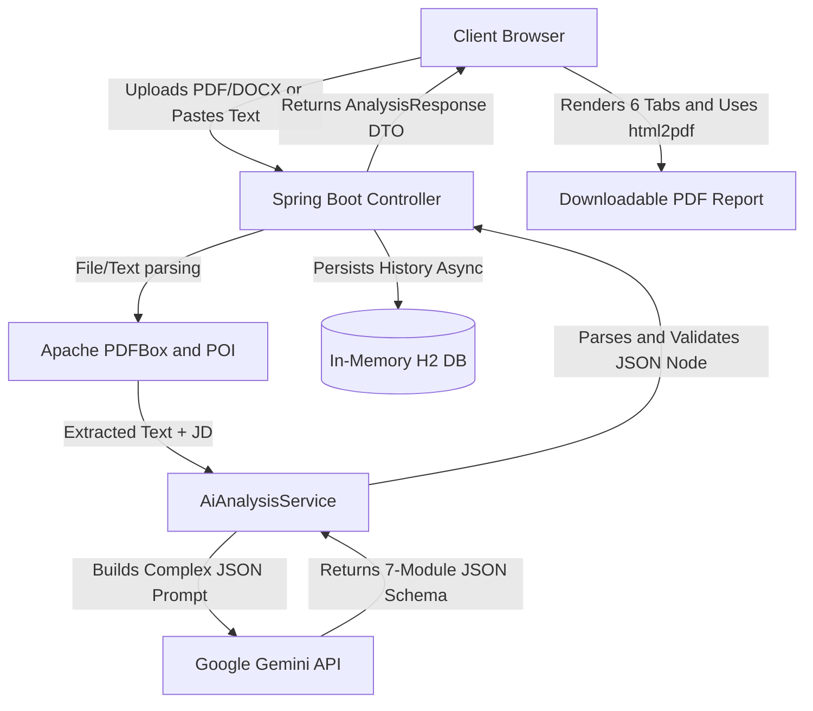

# SmartHire AI - Career Success Platform

**🚀 Live Project:** [https://smarthire-ai-27a5.onrender.com](https://smarthire-ai-27a5.onrender.com)

SmartHire AI helps candidates analyze resumes, optimize ATS performance, prepare for interviews, identify skill gaps, improve career readiness, and maximize job success.

SmartHire AI is an advanced, production-ready SaaS platform that goes far beyond simple resume parsing. It leverages the intelligence of Google Gemini to offer a complete Career Success Suite, seamlessly integrating document extraction, natural language processing, and personalized career guidance into one beautifully designed interface.

## New Career Success Suite Features

- Advanced ATS Scoring: Instantly calculates keyword and experience match scores against a specific Job Description.
- Keyword Gap Analysis: Automatically identifies missing technical and soft skills, categorizing them by High, Medium, or Low impact on your ATS ranking.
- Resume Enhancement Assistant: Provides section-wise, natural language rewrites to incorporate missing skills without keyword stuffing.
- AI Interview Preparation Center: Dynamically generates top personalized interview questions, categorized by difficulty, along with answering guidance.
- Profile Improvement Insights: Highlights your strongest matching areas and identifies missing experience indicators.
- Personalized Learning Roadmap: Maps out a custom learning path, including priority skills to learn, technologies to explore, and recommended certifications.
- ATS Improvement Simulator: Predicts your new ATS score after applying the AI's suggested resume enhancements.
- Career Success Report: Export all insights, roadmaps, and interview questions into a clean, downloadable PDF report.

## Architecture and Data Flow



## Technology Stack

- Frontend: Vanilla HTML5, CSS3 (Custom Design System), JavaScript (ES6), html2pdf.js
- Backend: Java 17, Spring Boot 3.3.4, Spring Web, Spring Data JPA
- AI Engine: Google Gemini 1.5 Flash (via REST API)
- Document Processing: Apache PDFBox (PDFs), Apache POI (Word Docs)
- Database: H2 In-Memory Database (for history tracking)
- Deployment: Render Web Services (CI/CD linked to GitHub)

## Setup and Local Deployment

### Prerequisites
- JDK 17+ installed
- Maven installed
- A Google Gemini API Key

### Installation

1. Clone the repository:
   ```bash
   git clone https://github.com/shayan-304/smarthire-ai.git
   cd smarthire-ai
   ```

2. Set your API Key:
   You must set the GEMINI_API_KEY environment variable.
   
   Windows (PowerShell):
   ```powershell
   $env:GEMINI_API_KEY="your_api_key_here"
   ```
   
   Mac/Linux:
   ```bash
   export GEMINI_API_KEY="your_api_key_here"
   ```

3. Run the application:
   ```bash
   mvn spring-boot:run
   ```

4. Access the application:
   Open your browser and navigate to http://localhost:8080.

## API Endpoints

| Method | Endpoint | Purpose |
|--------|----------|---------|
| POST | /api/analyze | Analyze via pasted text |
| POST | /api/upload-analyze | Analyze via PDF/DOCX file |
| GET | /api/health | Health check (Render uses this) |
| GET | /api/history | Last 20 saved analyses |
| GET | /api/stats | Total count and version info |

## Author

Mafaaz Shayan M - Electronics and Communication Engineering Student, Class of 2026

Built for learning backend development, REST APIs, file handling, and LLM integration using Java and Spring Boot.
